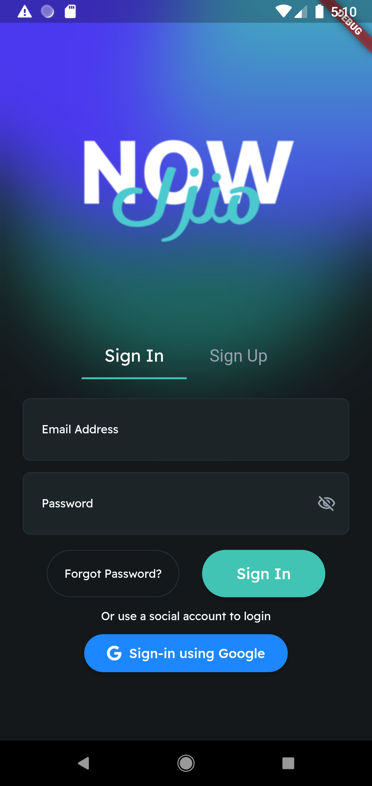
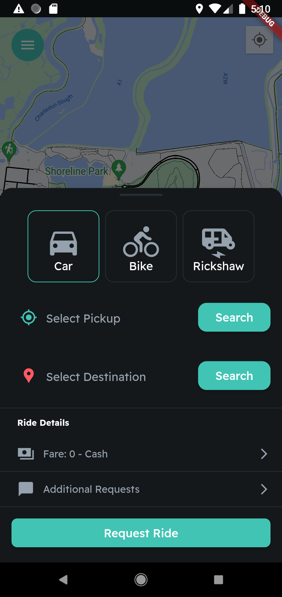
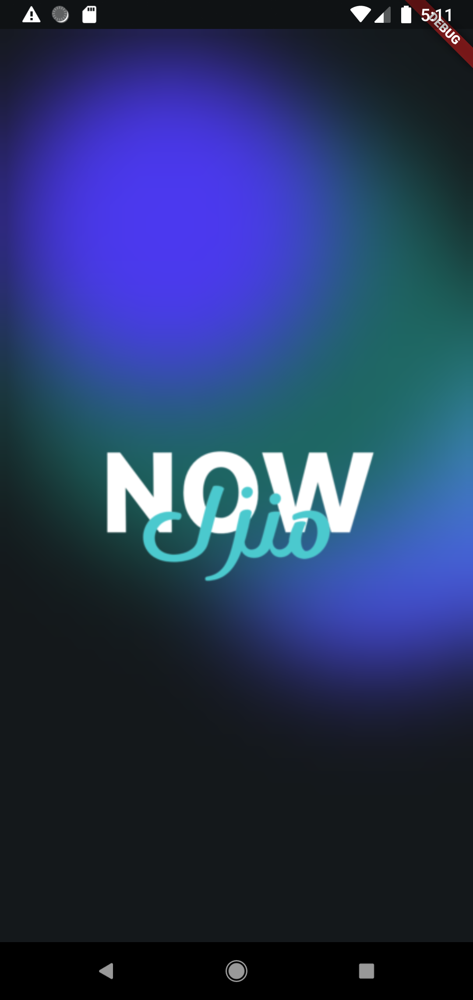
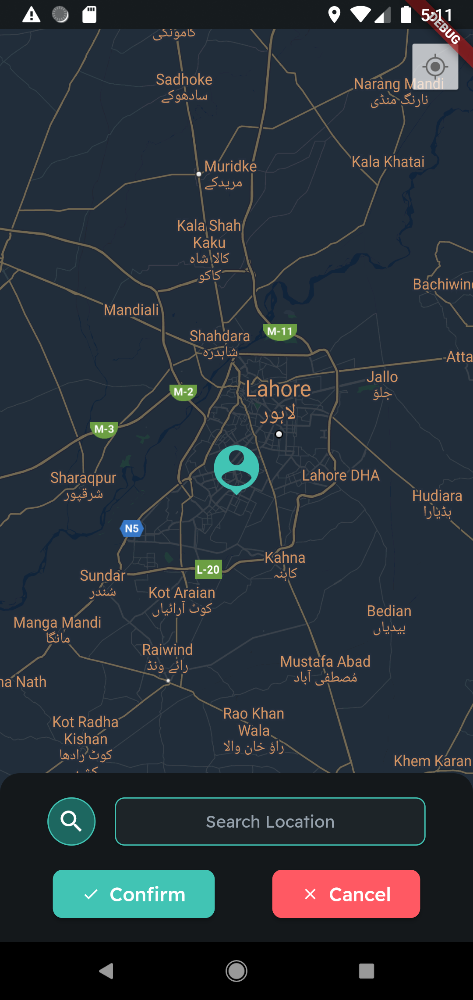
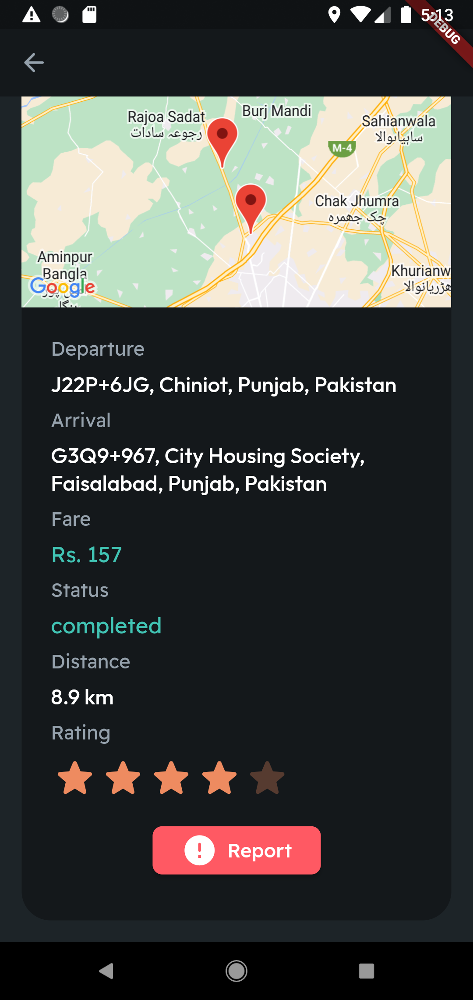

# ManzilNOW

ManzilNOW is a ride-hailing service similar to Uber, featuring two Flutter applications: one for passengers and one for drivers. The project utilizes Firebase as its database backend. 

## Screenshots

### Passenger App
<div style="display: flex; flex-wrap: wrap;">
    
  
  
    
    
</div>

## Key Features

### Passenger App
- **Sign Up & Sign In**: Seamless user authentication.
- **Real-time Tracking**: Track your ride in real-time.
- **Custom Widgets**: Unique and reusable components for an enhanced user experience.
- **Bargain System**: Negotiate fares with drivers.
- **Female-only Rides**: A dedicated portal for females to request female-only drivers for added safety.
- **View History**: Access past rides and transactions.
- **Payments**: Easy and secure payment options.

### Driver App
- **Sign Up & Sign In**: Secure driver authentication.
- **Real-time Tracking**: Monitor passenger locations and manage rides efficiently.
- **Custom Widgets**: Unique and reusable components to streamline the driver’s interface.
- **Bargain System**: Negotiate fares with passengers.
- **Ride Requests**: Accept or reject ride requests with a simple interface.
- **View History**: Access past rides and earnings.

## Getting Started

### Prerequisites
- Flutter SDK
- Firebase account

### Installation

1. Clone the repository:
    ```sh
    git clone https://github.com/RSAnjum/ManzilNOW.git
    ```

2. Navigate to the project directory:
    ```sh
    cd ManzilNOW
    ```

3. Install the dependencies:
    ```sh
    flutter pub get
    ```

4. Set up Firebase:
    - Go to the [Firebase Console](https://console.firebase.google.com/).
    - Create a new project.
    - Add Android and iOS apps to your Firebase project.
    - Follow the instructions to download the `google-services.json` and `GoogleService-Info.plist` files.
    - Place these files in the respective directories of your Flutter project (`android/app` and `ios/Runner`).

5. Run the app:
    ```sh
    flutter run
    ```

## Usage

- Launch the Passenger or Driver app on your device.
- Sign up or log in to your account.
- Start using the features such as real-time tracking, bargain system, and more.

## Contributing

Contributions are what make the open source community such an amazing place to learn, inspire, and create. Any contributions you make are **greatly appreciated**.

1. Fork the Project
2. Create your Feature Branch (`git checkout -b feature/AmazingFeature`)
3. Commit your Changes (`git commit -m 'Add some AmazingFeature'`)
4. Push to the Branch (`git push origin feature/AmazingFeature`)
5. Open a Pull Request

## License

Distributed under the MIT License. See `LICENSE` for more information.

